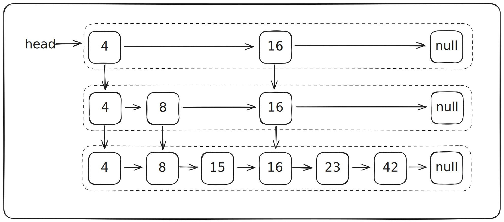

# Список с пропусками

### Напишите класс — реализацию множества на основе списка с пропусками

Список с пропусками (Skip list) — это вероятностная структура данных, позволяющая вставлять, удалять и искать
элементы в среднем за $O(log{n})$. Представляет из себя несколько уровней, каждый из которых является отсортированным
односвязным списком.

### Внутреннее устройство

Нижний уровень содержит все элементы в отсортированном односвязном списке, последующие уровни содержат также
отсортированную цепочку элементов, но некоторые из нижнего уровня могут отсутствовать. Элемент, находящийся на уровне `i`,
содержится в уровне `i + 1` с некоторой фиксированной вероятностью (как правило это `1/4`). Количество уровней ограничено
максимальным числом.



### Поиск элемента

Поиск начинается с первого элемента верхнего уровня. Пока текущий элемент меньше искомого, выбирается следующий элемент
того же уровня. Если найден равный элемент, поиск завершается успешно. Если дошли до конца списка, то элемент не найден.
Если же встретился элемент, больший искомого, то выбирается предыдущий (последний из меньших) и процедура поиска повторяется
с него уже на следующем, низшем уровне.

### Вставка

Сначала выбирается существующий элемент на нижнем уровне, после которого будет добавляться новый (наибольший из
всех меньших или ближайший слева). Элемент вставляется на нижний уровень, после "подкидывается монетка" и решается,
добавлять ли этот новый элемент на предыдущий уровень. Если результат положительный, то после вставки монетка подкидывается
вновь для определения, добавлять ли уже на уровень `n - 2`. И так до тех пор, пока не выпадет отрицательный результат
или элемент добавится на все возможные уровни.

### Удаление

После успешного нахождения элемента на нижнем уровне он удаляется со всех уровней, начиная с верхнего.

### Детали реализации

Класс `SkipListSet` должен быть обобщенным, имплементировать интерфейс `java.util.NavigableSet`и расширять
`java.util.AbstractSet`.

Должны быть реализованы методы:
```java
int size();
boolean isEmpty();
boolean contains(Object o);

// Добавляет элемент в set, если его там не было, и возвращает `true`, иначе `false`
boolean add(E e);

// Удаляет элемент из set, если он содержался внутри, и возвращает `true`, иначе `false`
boolean remove(Object o);

// Очищает все содержимое
void clear();

// Возвращает Comparator, с которым был создан set, или null
Comparator<? super E> comparator();

// Возвращает первый (минимальный) элемент или null, если set пустой
E first();

// Удаляет первый (минимальный) элемент и возвращает его, или null, если set пустой
E pollFirst();

// Возвращает последний (максимальный) элемент или null, если set пустой
E last();

// Удаляет последний (максимальный) элемент и возвращает его, или null, если set пустой
E pollLast();

// Наибольший элемент, который строго меньше искомого, или null
E lower(E e);

// Наибольший элемент, который меньше или равен искомому, или null
E floor(E e);

// Наименьший элемент, который больше или равен искомому, или null
E ceiling(E e);

// Наименьший элемент, который строго больше искомого, или null
E higher(E e);

// Восходящий итератор. В итераторе должны быть реализованы методы `hasNext`, `next` и `remove` согласно описанию в javadoc
Iterator<E> iterator();

// Нисходящий итератор
Iterator<E> descendingIterator();

// Set, отсортированный в обратном порядке. Изменения в этом set должны приводить к соответствующим изменениям
// оригинального set и наоборот
NavigableSet<E> descendingSet();

// Часть set с `fromElement` по `toElement`. Изменения в этом set должны приводить к соответствующим изменениям
// оригинального set и наоборот
NavigableSet<E> subSet(E fromElement, boolean fromInclusive, E toElement, boolean toInclusive);
SortedSet<E> subSet(E fromElementInclusive, E toElementExclusive);

// Часть set с начала по `toElement`. Изменения в этом set должны приводить к соответствующим изменениям
// оригинального set и наоборот
NavigableSet<E> headSet(E toElement, boolean inclusive);
SortedSet<E> headSet(E toElementExclusive);

// Часть set, начиная с `fromElement`. Изменения в этом set должны приводить к соответствующим изменениям
// оригинального set и наоборот
NavigableSet<E> tailSet(E fromElement, boolean inclusive);
SortedSet<E> tailSet(E fromElementInclusive);
```

Более подробное описание методов можно посмотреть в javadoc интерфейса, стоит следовать контрактам, которые там описаны

Класс можно сконструировать с компаратором; от любой коллекции; без параметров, тогда (как и в случае с коллекцией)
параметризованный тип должен имплементировать `Comparable<E>`, а если параметризовать типом без `Comparable<E>`, то
методы `add`, `remove`, `contains` и другие, принимающие обект или коллекцию параметризованного типа `E`, должны кидать `ClassCastException`;

В качестве вероятности используйте число в промежутке `(0, 1/2]`, можно взять `1/4`.
Для максимального количества уровней достаточно взять число 32.

Ваши файлы должны находиться в пакете `hometask.collections`. В пакете должен быть один класс `SkipListSet`.
Для генерации случайных чисел можно использовать класс `java.util.Random`
В качестве jdk рекомендуется использовать версию 21.
